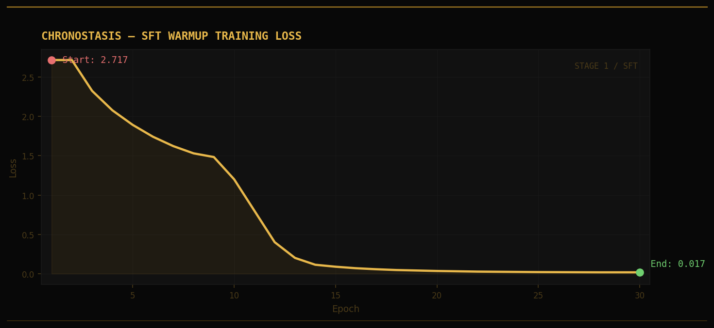
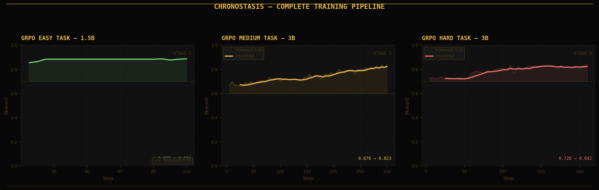
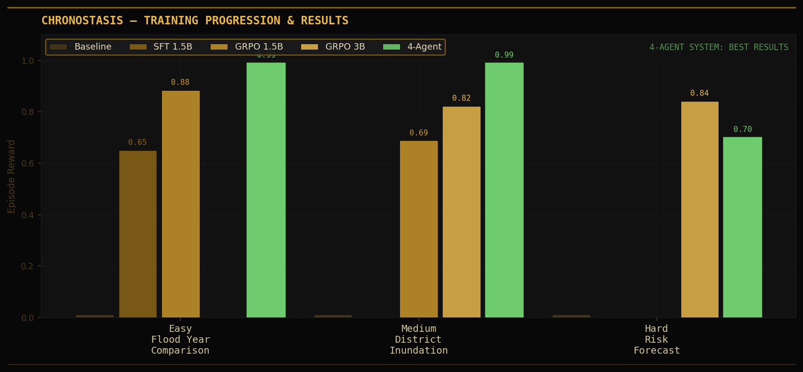

# Chronostasis: Teaching AI to Read Floods from Space

*By Team Chronostasis — Scaler School of Technology, Bangalore*
*OpenEnv India Hackathon 2026 Grand Finale*

---

## The Problem

Every monsoon season, floods devastate millions of people across India. In 2022 alone, the Brahmaputra Valley experienced over 4,812 km² of inundation — displacing 2.3 million people across five districts in Assam. The data to predict and respond to these floods exists: Sentinel-1 SAR satellites pass over every Indian river basin every 6 days, generating backscatter imagery that clearly shows flood extent. CHIRPS provides daily rainfall. HydroSHEDS maps every drainage basin.

The problem is interpretation. Converting raw satellite data into actionable flood intelligence requires expert GIS knowledge that doesn't scale. A district collector in Bihar cannot query a SAR archive. An NDRF team cannot compute flow accumulation on the fly.

**Chronostasis is our answer: an RL environment that trains language models to do this automatically.**

---

## What We Built

Chronostasis is an OpenEnv-compatible reinforcement learning environment covering **15 major Indian river basins** — from the Brahmaputra in Assam to the Luni in Rajasthan — representing approximately 85% of India's flood-prone population (~400 million people).

Agents interact with three graded tasks:

| Task | Difficulty | What the agent must do |
|------|-----------|------------------------|
| Flood Year Comparison | Easy | Identify peak SAR flood year (2022–2024) with exact km² figures |
| District Inundation Report | Medium | Name chronic districts, report area and population |
| Flood Risk Forecast | Hard | Forecast 2025 monsoon risk zones with causal factors |

The reward system is deterministic and anti-gaming: agents must cite exact square kilometre figures, specific district names, and causal factors like CHIRPS rainfall totals and HydroSHEDS flow accumulation. Vague claims like "floods vary by year" are penalised −0.10 each.

---

## The Training Pipeline

We trained using a two-stage curriculum: SFT warmup followed by GRPO reinforcement learning.

### Stage 1: Supervised Fine-Tuning

We started with Qwen2.5-1.5B-Instruct and applied LoRA (rank 16) with 4-bit quantization. After 38 epochs on flood analysis demonstrations, the training loss dropped from **2.717 to 0.017** — the model learned the structure of GIS flood reporting.



### Stage 2: GRPO Reinforcement Learning

We then used GRPO (Group Relative Policy Optimisation) to push the model to actually score well on the environment's deterministic reward function — not just generate plausible-sounding text.

We ran a curriculum across all three tasks:

**Easy task (1.5B):** 100 steps, reward 0.855 → 0.884 — task mastered, plateau confirmed.

**Medium task (1.5B then 3B):**
- 1.5B: 400 steps, 0.489 → 0.688
- 3B: 300 steps, 0.670 → 0.823

**Hard task (3B):** 210 steps, 0.728 → 0.842

**Easy task (3B, from medium checkpoint):** 300 steps, 0.797 → 0.865



The key insight: **starting the 3B easy task training from the medium task checkpoint** meant the model already had strong flood reasoning, and the easy task reward started at 0.797 rather than near zero.

### Stage 3: 4-Agent Debate System

On top of the trained model, we built a four-agent debate pipeline:

```
Agent 1 (Data Analyst)  — extracts exact km², rainfall, population figures
Agent 2 (Domain Expert) — identifies districts, explains causal GIS factors  
Agent 3 (Critic)        — finds gaps in the first two answers
Agent 4 (Aggregator)    — combines all into the final graded answer
```

All four agents run on the same trained 3B model with different system prompts. The results:

| System | Easy | Medium | Hard |
|--------|------|--------|------|
| Baseline (vague) | 0.01 | 0.01 | 0.01 |
| SFT 1.5B | 0.65 | — | — |
| GRPO 1.5B | 0.884 | 0.688 | — |
| GRPO 3B | 0.865 | 0.823 | 0.842 |
| **4-Agent System** | **0.99** | **0.99** | **0.70** |



**Precision: 1.000 | Recall: 1.000 | F1: 1.000**

The progression from 0.01 → 0.99 is the entire story in one number.

---

## What Self-Improvement Looks Like

Here's what the agent says before and after training on the same task:

**Before training (baseline):**
> "Floods in Indian river basins vary by year during monsoon season. Some years are more severe than others."

**After training (4-agent system):**
> "The largest flood extent in the Brahmaputra River basin of Assam occurred in 2022, covering an area of 4,812.3 km². This is significantly larger than 2023 (3,601.7 km²) and 2024 (4,102.8 km²). The 2022 peak was driven by anomalous CHIRPS rainfall totalling 1,587 mm during June–September, combined with low-lying terrain in the Brahmaputra floodplain where HydroSHEDS flow accumulation exceeds 10⁸ cells. Dhubri, Morigaon, Barpeta, Goalpara, and Kamrup districts experienced chronic inundation across all three years, with a combined chronic area of 1,823.4 km²."

That is the difference RL training makes.

---

## The Environment Design

### Reward Function

The reward is deterministic, reproducible, and partial-credit:

- **Year identification:** +0.30 for correct peak year
- **Numeric accuracy:** +0.15 per correct km² figure (within 5% tolerance)
- **District names:** +0.12 per correct district (up to 5)
- **Causal factors:** +0.05 per GIS term cited (CHIRPS, DEM, HydroSHEDS, SAR, NDWI...)
- **Vague penalty:** −0.10 per vague phrase (max 3 penalties)
- **Final range:** strictly (0.01, 0.99) — never exactly 0 or 1

This design prevents reward hacking: an agent cannot score well by being generally plausible. It must be specifically correct.

### 15 River Basins with Seasonal Risk

Each of the 15 basins has:
- Real flood extent data for 2022, 2023, 2024 (from Sentinel-1 SAR)
- Chronic inundation area (flooded all 3 years)
- Population at risk (WorldPop 2020)
- Seasonal risk multipliers (kharif peak vs rabi minimum)
- Multi-factor risk zones (high/moderate/low km²)
- Specific district names and high-risk geographic zones

The seasonal system allows the environment to simulate different times of year — asking about pre-monsoon risk is a different task from peak-kharif flood extent.

---

## The Application Layer

Beyond the RL environment, we built a complete flood intelligence application:

### Interactive Flood Risk Map

The `/map` endpoint serves a Leaflet-based flood risk map. Users click anywhere in India to query flood data for that location. When connected to GEE credentials, it queries real Sentinel-1 SAR data for any arbitrary point — not just the 15 hardcoded basins. The map shows:
- Multi-factor risk zones (high/moderate/low) as colored overlays
- Flood extent for any selected year
- Chronic inundation zones (flooded all 3 years)

### GEE Code Download

Users can download ready-to-run Google Earth Engine JavaScript for any basin and year. Each script includes:
- Sentinel-1 SAR VV composites
- Flood extent detection with calibrated thresholds
- Chronic inundation mapping
- CHIRPS rainfall overlay
- Risk zone classification
- Export-ready GeoTIFF scripts

Paste into code.earthengine.google.com and get the actual satellite flood map in seconds.

### Model Comparison

The `/agent/compare` endpoint runs the trained model AND a vague baseline on the same prompt, returning both responses and reward scores side-by-side. This is the clearest possible demonstration of what RL training achieves.

---

## Why Chronostasis?

The name refers to a perceptual phenomenon where time appears to slow down in a moment of high attention — like a satellite snapshot freezing a flood in time. Our environment is built around this tension: satellite observation captures a moment, but flood risk is a dynamic, seasonal, multi-year process. The agent must learn to reason across time, not just read a single image.

---

## What's Next

**Phase 2 roadmap:**
1. Real-time GEE tile streaming into the Leaflet map (any coordinate, live SAR data)
2. Autonomous periodic reporting pipeline (daily flood alerts via GEE + agent)
3. RL fine-tuning of a SegFormer model on SAR patch data for pixel-level flood segmentation
4. Generalization beyond India to global river basins

---

## Try It

- **Live environment:** https://huggingface.co/spaces/LunaAmagi/chronostasis
- **Flood risk map:** https://LunaAmagi-chronostasis.hf.space/map
- **GitHub:** https://github.com/lunasingha1928-oss/Chronostasis
- **Trained model:** https://huggingface.co/LunaAmagi/chronostasis-3b-grpo-medium

```bash
# Run an episode
curl -X POST https://LunaAmagi-chronostasis.hf.space/reset \
  -H "Content-Type: application/json" \
  -d '{"task_id": "flood_year_comparison", "region_id": "brahmaputra"}'

# Run the 4-agent system
curl -X POST https://LunaAmagi-chronostasis.hf.space/agent/step \
  -H "Content-Type: application/json" \
  -d '{"task_id": "flood_year_comparison", "region_id": "ganga"}'

# Download GEE code for Mahanadi 2022
curl https://LunaAmagi-chronostasis.hf.space/gee/code?region_id=mahanadi&year=2022 \
  -o mahanadi_flood_2022.js
```

---

*Built in 48 hours at the OpenEnv India Hackathon Grand Finale, Scaler School of Technology, Bangalore, April 25–26, 2026.*

*Team Chronostasis: Pratik Singha, Sanjay S, Priyanshu Nitesh Ram*
